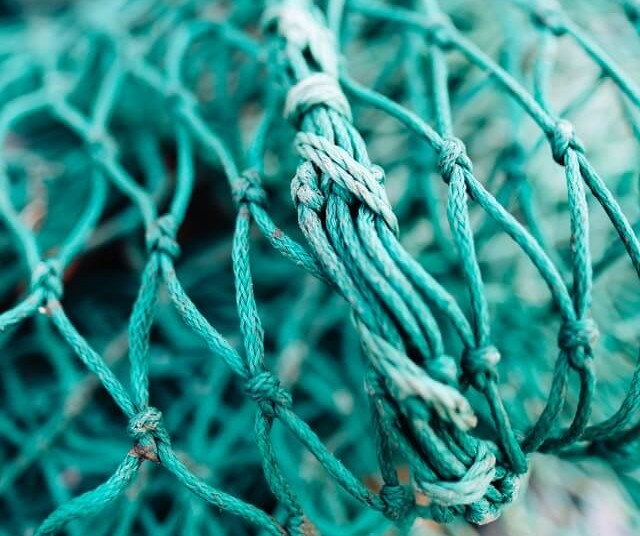

- ## 互联网
  id:: 62028aa1-a819-4d84-b5bd-0115e27c0603
	- ### 什么是网络？ #card
	  card-last-score:: 5
	  card-repeats:: 1
	  card-next-schedule:: 2022-02-12T15:34:20.276Z
	  card-last-interval:: 4
	  card-ease-factor:: 2.6
	  card-last-reviewed:: 2022-02-08T15:34:20.278Z
		- 
		- 网是由各个`结点`通过之间的`线`连接一起的。
		- 网络也是如此，不过`结点`代表的是一台台电子设备(电脑、手机、智能电视等)，而线，就代表把他们连接起来的线路(网线、 WIFI等)
	- ### 内网/外网是什么意思？ #card
		- 内网通常也称`局域网`。
		- 什么是内网？就是仅供内部人员使用的内部网络，如果你现在用着WiFi上网，那么你已经同连接上这个WiFi的设备组成了一个内网了（手机、智能电视、电脑、甚至蹭网者的设备），如果你查看你的 `wifi` 的 `ip` 地址，会发现是 `192.168.xxx.xxx` （或者有可能是`10.xxx`、`172.xxx`）打头的地址。
		- 那什么是外网？外网相对于内网，就是内网外面的……网，简单理解就是`互联网`，说白了，`互联网`其实就是一个一个内网组成的网。
		- 额……还是有点绕？那形象点说，内网就是一栋栋建筑，每一台设备就相当于一个房间(`101`号房、`102`号房……)。
			- 而建筑之间靠什么连接？靠的是道路，由城市之间的马路将城市内的建筑相互连接，城市之间通过城际高速公路连接在一起……对应网络世界，道路就是网线、交换机、基站。
			- 移动、电信、联通这些网络运营商所做的就是将这些路铺开，铺到每一户人家房门口。当然了，你要使用这些道路的话，必然不是免费的，要交钱，称之为`网费`。
			- 不交网费你当然也可以自己组一个内网，但这样的话，你的内网没有任何道路了，出不去，别人也进不来。
	- ### 什么是互联网？ #card
		- 人们住在一栋栋楼里(局域网) -> 一栋栋楼组成了一个城市(城际网) -> 城市组成了一个国家(国家网?) -> 国家之间组成了世界(`互联网！`)
		- 所以，互联网就是由各个网络组成的`最大`的那张网……
		- 当然，就像现实世界，不是什么地方都可以去的。比如，没有经过他人同意，不能进别人的房间(内网)，一些重地，也是不对外人开放的……不过里面的人想出来还是可以实现的。
		- 而那些没交网费钱的，就像建在悬崖峭壁绝地上的房子，无法进去，里面的人也出不来……